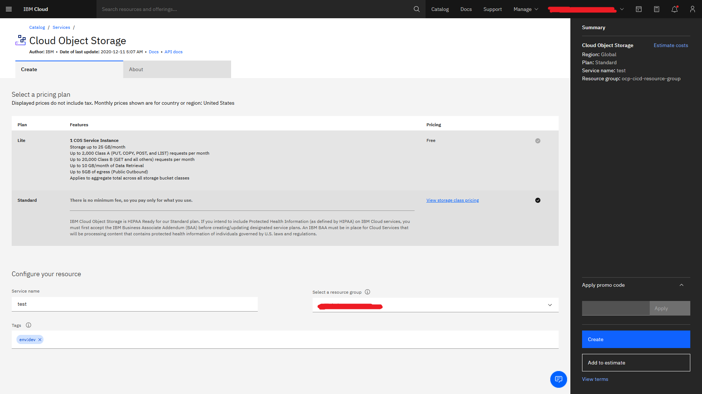
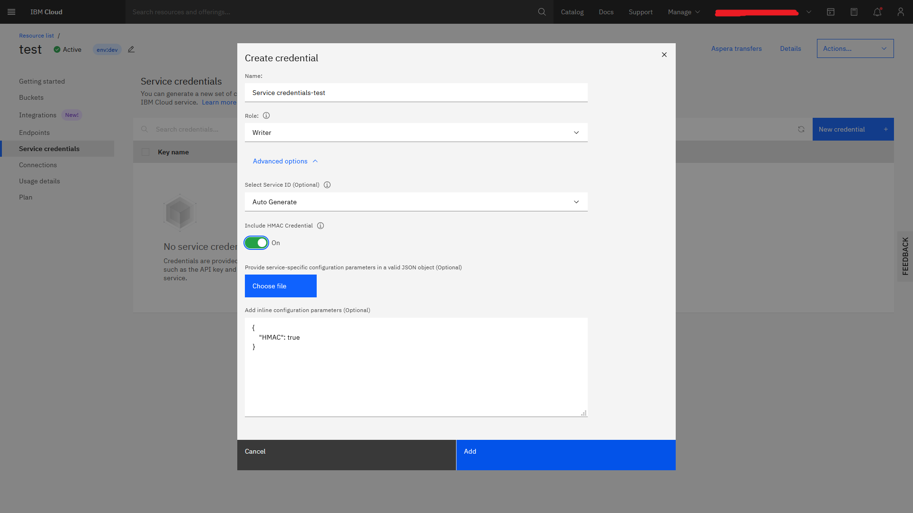
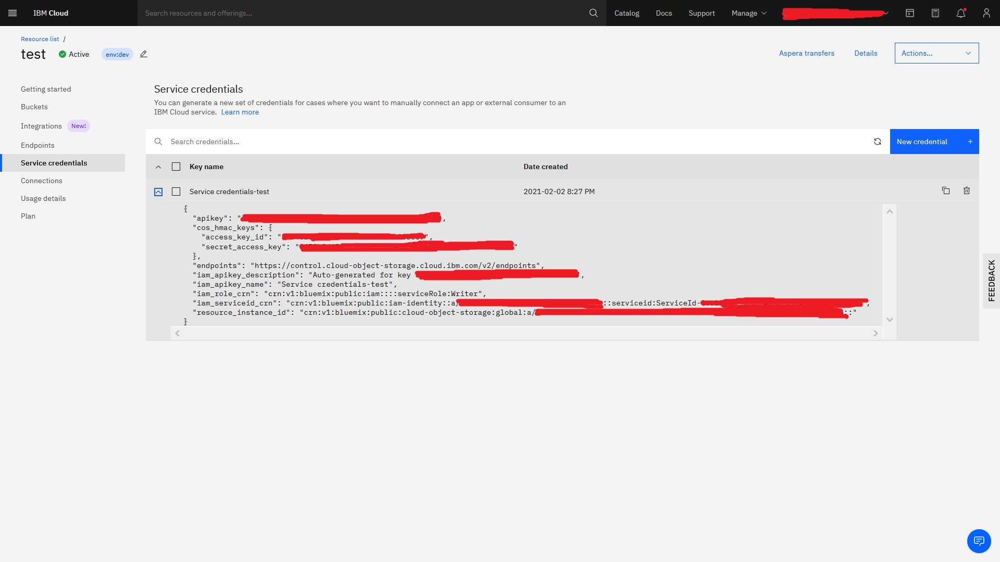
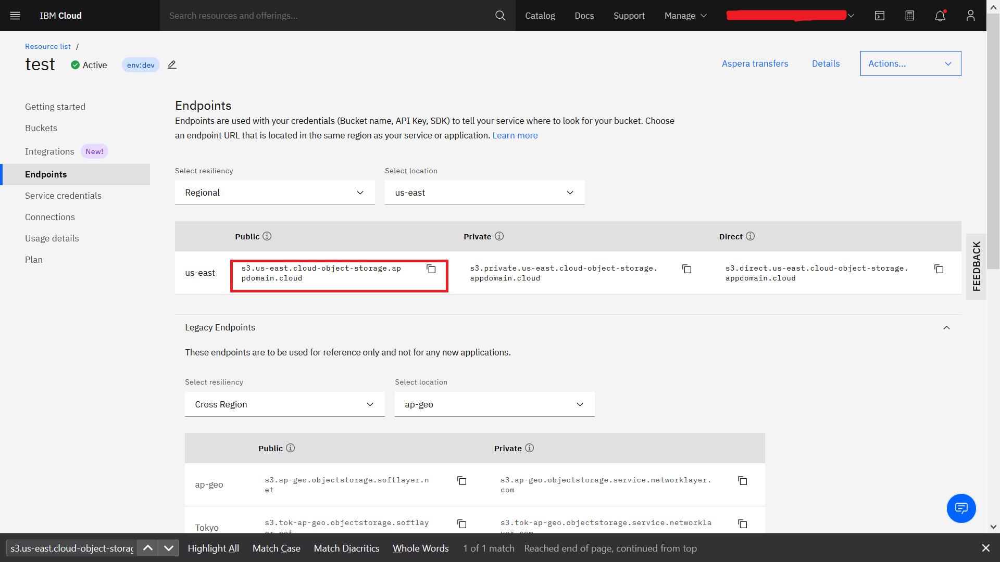

# IBM cloud storage as a persistent volume storage

## Introduction

### Why IBM cloud storage?

The details about the cluster that is created needs to be persisted. This details should be available to access the cluster or to delete it when the job of the cluster is done. Here we take IBM Cloud Object Storage as a perstitent volume for its highly scalable, designed for high durability, resiliency and security. Manage the access by fine grained policies which ensures only the right person has access to the cloud storage. The data can be integrated with other IBM services to further enhance the customer experience.

For more details on IBM cloud storage follow this [link](https://cloud.ibm.com/docs/cloud-object-storage).

## Prerequisite

	1. IBM Cloud account
	2. Create IBM Cloud Object Storage
	3. Openshift cli

## How to create a IBM cloud storage

Provide appropriate values and click on create button.

Once created, Under the service credentials section, select role as writer and enable HMAC credential if required.

Expand the service credential that was just created and the resource details are required for creating the cluster.

Under endpoints select your region/location to fetch appropriate s3 endpoint.

## Variables

Populate the following values from the IBM cloud storage service credentials and endpoints.

	API_KEY           = "apikey"
	ACCESS_KEY_ID     = "Access_key_id" (OPTIONA - for HMAC)
	SECRET_ACCESS_KEY = "secret_access_key" (OPTIONAL - for HMAC)
	ibm.io/region     = "us-east"
	ibm.io/endpoint   = "s3.us-east.cloud-object-storage.appdomain.cloud" (public)

From service credentials details copy the resource_instance_id and fetch the GUID of the service instance like below,

Using linux terminal

	$ echo "crn:v1:bluemix:public:cloud-object-storage:global:a/65b61c1f1c2946048c2e4bbfbda93c2c:289d5094-3c1d-442e-bcm8-23190d01c65::" | cut -f8 -d":"

	289d5094-3c1d-442e-bcm8-23190d01c65

OR

Using IBM cloud shell or ibmcloud cli

	ibmcloud resource service-instance <IBM_CLOUD_STORAGE_NAME> | grep GUID
	
	GUID: 289d5094-3c1d-442e-bcm8-23190d01c65

	IBM_CLOUD_STORAGE_SERVICE_ISNTANCE_GUID = "289d5094-3c1d-442e-bcm8-23190d01c65"

## Installation

### Verify s3fuse driver binary and provisioner container

Driver binary already present in the following location in openshift on each worker nodes,

    $ ls /etc/kubernetes/kubelet-plugins/volume/exec/ibm~ibmc-s3fs/
      ibmc-s3fs

If not found you can follow the link in the reference section.

### Install provisioner

To run provisioner container run the below scripts

    $ oc create -f storage/ibm-cloud/provisioner-sa.yaml
    $ oc create -f storage/ibm-cloud/provisioner.yaml
    $ oc create -f storage/ibm-cloud/ibmc-s3fs-standard-StorageClass.yaml

### Verify IBM Cloud Object Storage plug-in/provisioner installation

	$ oc get pods -n kube-system | grep object-storage
      ibmcloud-object-storage-plugin-0s4df85ff6-i7y91   1/1       Running   0          28s

    $ oc get storageclass |grep s3
      ibmc-s3fs-standard           ibm.io/ibmc-s3fs

### Store the IBM cloud service credentials on the openshift secrets

Create a new project/namespace using command below (OPTIONAL)  

	oc new-project  ocp-cluster-CLUSTERID --description="create ocp cluster on syd region" --display-name="ocp-cluster-CLUSTERID"

If not created then default project/namespace will be used.

Create secrets, volumes and pods on the same namespace.

	$ oc create secret generic <SECRET_NAME> --type=ibm/ibmc-s3fs --from-literal=api-key=<API_KEY> --from-literal=service-instance-id=<IBM_CLOUD_STORAGE_SERVICE_ISNTANCE_GUID>

OR HMAC authentication (OPTIONAL)

	$ oc create secret generic <SECRET_NAME> --type=ibm/ibmc-s3fs --from-literal=access-key=<ACCESS_KEY_ID> --from-literal=secret-key=<SECRET_ACCESS_KEY>

Take a note on the <SECRET_NAME> as it will be used while creating the pvc.

Verify that the secret is created in your namespace

	$ oc get secret

### Create a PVC

	kind: PersistentVolumeClaim
	apiVersion: v1
	metadata:
	  name: <PVC_NAME>
	  namespace: <NAMESPACE_NAME>
	  annotations:
	    volume.beta.kubernetes.io/storage-class: "ibmc-s3fs-standard"
	    ibm.io/auto-create-bucket: "true"
	    ibm.io/auto-delete-bucket: "false"
	    ibm.io/bucket: "<BUCKET_NAME>"
	    ibm.io/object-path: ""    # Bucket's sub-directory to be mounted (OPTIONAL)
	    ibm.io/endpoint: "<ENDPOINT>"
	    ibm.io/region: "<REGION>"
	    ibm.io/secret-name: "<SECRET_NAME>"
	    ibm.io/stat-cache-expire-seconds: ""   # stat-cache-expire time in seconds; default is no expire.
	spec:
	  accessModes:
	    - ReadWriteOnce
	  resources:
	    requests:
		  storage: 8Gi # fictitious value

### Create/Destroy a cluster

Follow the below link to create the cluster using OCP pod. Make sure you update the volume mount options with the newly created provisioner for IBM cloud storage as a persistent storage.

Please refer to the sample scripts under storage\ibm-cloud\scripts location.

[Create cluster](https://github.com/ocp-power-automation/ocp-upi-powervs-pod)

### How to read the cluster details after persisted?

Once inside the IBM cloud storage bucket.

Download the create.log file and scroll towards the end of the logs to find details about the cluster that is created.

Or

Download the bucket data on to your local and run terraform show (make sure you have terraform installed).

Or

Create a sample pod with the bucket mount. exec into the pod and navigate to the volume mount directory and read the contents from there.

## References

[Generate using helm charts](https://cloud.ibm.com/docs/containers?topic=containers-object_storage)

[Generate the plugin binary and provisioner manual steps](https://github.com/IBM/ibmcloud-object-storage-plugin)
